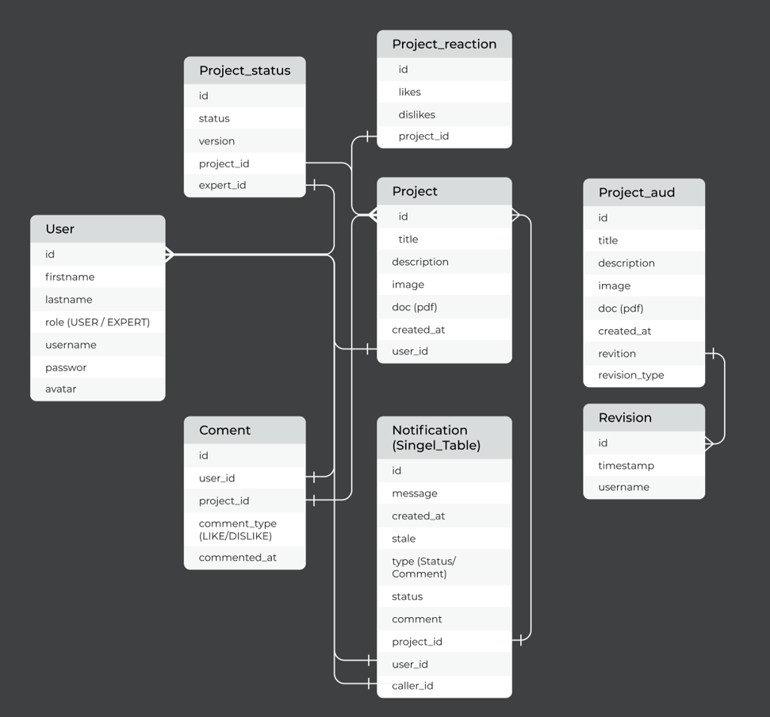
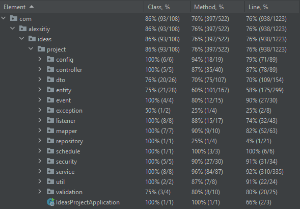
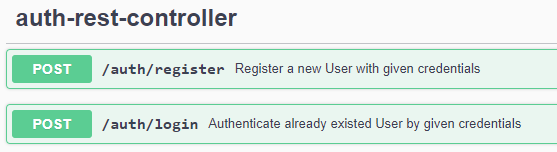
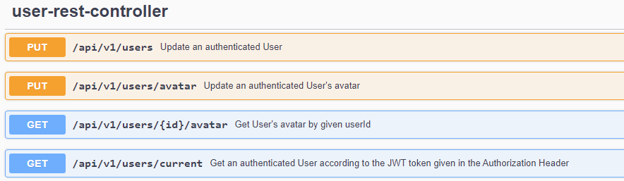
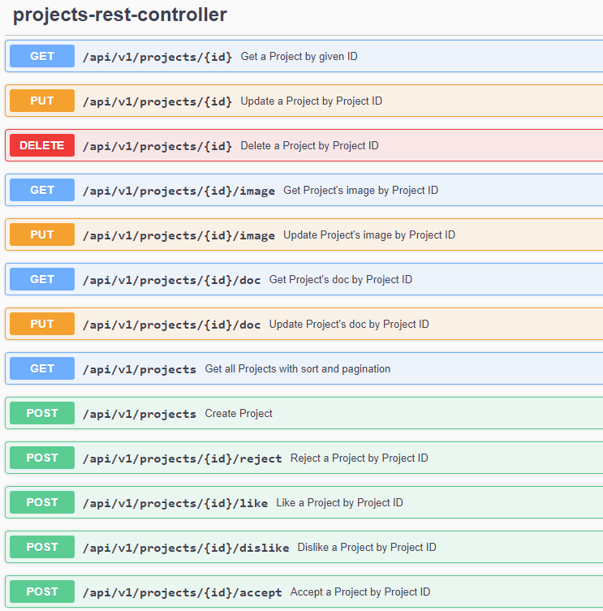
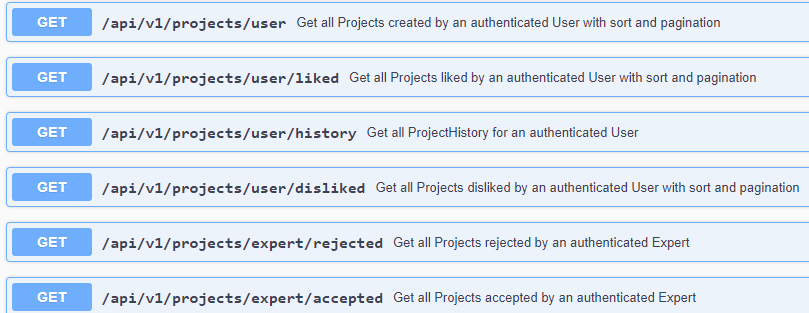
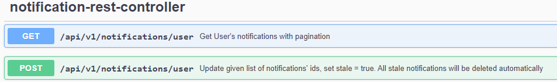

# Ideas Project

## Description

"Ideas Project" is a web application where users can create an account, suggest their own ideas, and publish them for others to explore. Users can like or dislike ideas, and the creators receive notifications for these interactions. Additionally, the platform has a special type of user called "Experts" who can evaluate the appropriateness of ideas. When an idea is evaluated, the creator is notified via email and within the application.

## Features

### Users

- **Account Management:** Users can easily register and log in to their accounts, where they have full control over their profile information, including their name, surname, and avatar.

- **Create and Manage Ideas:** Users can unleash their creativity by crafting new ideas with a wealth of details, such as a name, description, captivating images, and important attached PDF documents. They have the freedom to update and delete their own ideas.

- **Idea Metrics and Sorting:** Users can efficiently navigate through their creations and sort them based on various metrics to gain valuable insights.

- **Interact with Ideas:**  Engaging with other users' ideas is seamless; users can express their appreciation or feedback by liking or disliking them, resulting in thoughtful notifications for the creators.

- **View Liked/Disliked Ideas:** Users can effortlessly access a list of all the ideas they have liked and disliked and conveniently sort them based on specific metrics.

- **Idea History:** The application keeps a detailed record of users' idea history, which includes created, updated, and deleted ideas, enabling users to track their journey of innovation.

- **Notifications:** Users stay informed through timely notifications regarding significant events, such as likes, dislikes, or expert estimations.
### Experts

In addition to the features available to regular users, experts have the following capabilities:

- **Evaluate Ideas:** As experts, they play a pivotal role in the platform by evaluating other users' ideas for appropriateness, contributing to the overall quality of the content.

- **View Evaluation Metrics:** Accessing and organizing a list of ideas they have evaluated based on specific metrics empowers experts to make informed decisions.
## Technology Stack
The "Ideas Project" is built using the following technology stack:

- **Spring Boot:** The core framework for building the application.
    - [spring-boot-starter-data-jpa](https://spring.io/projects/spring-boot#learn)
    - [spring-boot-starter-mail](https://spring.io/projects/spring-boot#learn)
    - [spring-boot-starter-security](https://spring.io/projects/spring-boot#learn)
    - [spring-boot-starter-web](https://spring.io/projects/spring-boot#learn)
    - [spring-boot-starter-validation](https://spring.io/projects/spring-boot#learn)

- **QueryDSL:** A powerful library for type-safe querying and manipulation of JPA entities.
    - [querydsl-jpa](https://querydsl.com/)
    - [querydsl-apt](https://querydsl.com/)

- **Spring Data Envers:** Enables auditing of entities using Hibernate Envers for versioning and history tracking.
    - [spring-data-envers](https://spring.io/projects/spring-data#envers)

- **Database:**
    - [PostgreSQL](https://www.postgresql.org/): A robust and feature-rich relational database.
    - [Liquibase](https://www.liquibase.org/): A database schema version control and migration tool.
  
- **API Documentation:**
    - [Springdoc OpenAPI](https://springdoc.org/): Provides automated OpenAPI documentation and UI for the API.
        - [springdoc-openapi-starter-webmvc-ui](https://springdoc.org/#actuator-and-springdoc-openapi-ui): The OpenAPI UI starter for Spring WebMVC.

- **Amazon S3 SDK:** A software development kit for Amazon S3, enabling file storage capabilities (e.g., PDF documents).
    - [software.amazon.awssdk:s3-transfer-manager](https://aws.amazon.com/sdk-for-java/)

- **Auth0 Java JWT:** A library for parsing and validating JWT tokens.
    - [com.auth0:java-jwt](https://github.com/auth0/java-jwt)

- **Testing Frameworks:**
    - [JUnit 5](https://junit.org/junit5/): A popular testing framework for Java.
    - [Mockito](https://site.mockito.org/): A mocking framework for unit testing.
    - [Testcontainers](https://www.testcontainers.org/): Enables easy integration testing using real database instances.

## Database Schema

Below is the database schema used in the "Ideas Project" application:

## Testing

Testing is a critical aspect of the "Ideas Project" to ensure the reliability and stability of the application. I have implemented various levels of tests to cover different parts of the codebase.

### Test Coverage

Test suite has achieved a test coverage of **`76%`**, as depicted in the following image:

### Test Levels

1. **Unit Tests:** I have added unit tests that focus on testing individual components and functions in isolation. These tests help verify the correctness of critical algorithms and functionalities.

2. **Integration Tests:** Integration tests validate the interaction between different components and modules to ensure they work harmoniously together.

## API Documentation
The API documentation is generated using Swagger and provides an interactive UI to explore the endpoints and their functionality. Below are some images of the API documentation:

To access the live API documentation, run the application and navigate to the following URL:
http://localhost:8080/swagger-ui/index.html

## Installation

1. Clone this repository.
2. [Provide instructions on how to set up the database and other configurations]
3. Build the project using Gradle: `./gradlew build`
4. Run the application: `./gradlew bootRun`